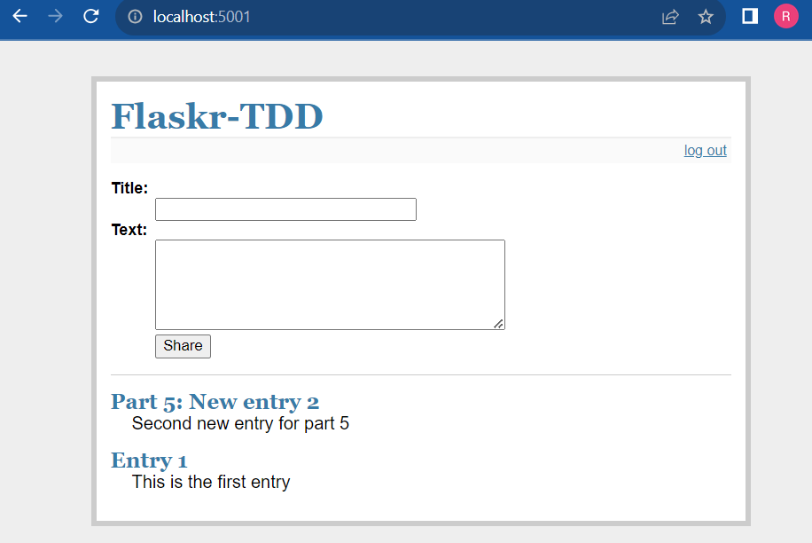

# ECE444 Lab 5 - Rowan Honeywell - 1007972945 #

## Test case file in the team project: ##

`ECE444-2023Fall/project-1-web-application-design-group1-flask-and-furious/blob/main/__tests__/sliders.test.tsx`

## Pros and Cons of TDD: ##

**Pros:** 

The advantages of TDD are extremely identifiable.
Firstly, it should be noted how TDD helps facilitate a modular design approach.
A modular design for an application is important as it helps break the workflow down into smaller parts, which in turn are **easier to maintain**.
TDD promotes a modular approach as it requires each separate feature to be considered on its own, and not so much as part of a more complex collective.

Another important advantage of TDD is the improved **ease of debugging**.
This is also a feature of modular design.
Instead of meticulously parsing through a large amount of code to locate a bug, TDD helps identify the bug, and a modular design helps insure that fixing the bug will only alter the corresponding feature, not the whole application.

**Cons:**

Despite the general increased ease of maintenance that TDD allows, there is a slight exception for when large, significant changes are made to the code.
When a large change (such as a new/different functional requirement) occurs, not only does the source code need to be maintained to facilitate this change, but the tests need to be changed as well. Therefore, there is a trade-off between the ease of general maintenance and the time it takes to make large changes when TDD is used.

## Step 1: ##

## Step 2: ##

## Step 3: ##

## Step 4: ##
### Home: ###

### Login: ###

### Entry: ###

### Post: ###

### Logout: ###

## Step 5: ##
### New Entries: ###

### Deletion: ###

### Test: ###

## Step 6: ##

## Step 7: ##
### Test (SQLAlchemy): ###

### New entry: ###

## Step 8: ##

## Step 9: ##

## Step 10: ##
### Flake8: ###

### Black: ###

